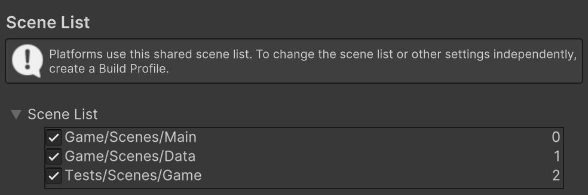

## Гайд по использованию SceneLoader

### Шаг первый - проверка

Всегда сцены в Scene List и EScene должны совпадать порядком




### Шаг второй - создание сцен
Если нет **Main** сцены, то:
1) создай пустую сцену 
2) Добавь туда **EventSystem**
3) Cоздай пустой объект(Create Empty), 
по стандарту предлагаю назвать его **SceneLoader**.
4) На объект **SceneLoader** добавь скрипт **SceneLoader**

### Шаг третий - знакомство с интерфейсом

В интерфейсе **SceneLoader** есть всего поля:


1) **Start Scene** - отвечает за то какая(ие) сцена(ы) должны быть загружены
при старте **Main** сцены 
2) **Loading Ui** - **Game Object** помещенный в данное поле может быть включен
при загрузке/выгрузки сцены

### Шаг четвертый - настройка префабов сцен 
Иногда бывает так, что при старте **Main** сцены, нужно загрузить несколько сцен.
В таком случае нужно обратиться к скрипту **PrefabsScenes**


В нем есть всего один метод - **AddingPrefabs()**. 
В него и нужно записывать префабы, по данному шаблону: 

```C#
_prefabs.Add(EScenes.ИмяСценыStartScene, new EScenes[] { EScenes.ИмяСценыStartScene, EScenes.ИмяНужнойСцены1,  EScenes.ИмяНужнойСцены2 ...});
```

### Шаг пятый - использование **SceneLoader** в своих скриптах

#### Обращение к **SceneLoader**
Для того, чтобы иметь возможность использовать **SceneLoader**, надо добавить
соответствующий **using**:
```C#
using SceneLoader;
```
#### Использование функции **Load**
Для загрузки сцен(ы) нужно использовать следующее выражение: 
```C#
SceneLoader.Loader.Load()
```
В него можно передать два параметра: 
1) **scene** или **scenes**. В этот параметр можно передать сцену из **EScenes** или массив таких сцен
2) **activeLoadingUi**. Нужно ли включать загрузочный экран. Принимает **true** или **false**. Этот параметр писать не обязательно. По умолчанию стоит **true**

#### Использование функции **Unload**
Для выгрузки сцен(ы) нужно использовать следующее выражение:
```C#
SceneLoader.Loader.Unload()
```
В него можно передать три параметра:
1) **scene** или **scenes**. В этот параметр можно передать сцену из **EScenes** или массив таких сцен
2) **activeLoadingUi**. Нужно ли включать загрузочный экран. Принимает **true** или **false**. Этот параметр писать не обязательно. По умолчанию стоит **true**
3) **forceUnload**. Принудительная выгрузка сцен. Есть сцены, которые нельзя выгрузить(Например **Data**)
И если такие сцены вдруг надо выгрузить, то можно передать значение **true**. В иных ситуациях
стоит оставить этот параметр пустым или передать **false**

#### Использование функции **UnloadAll**
Для выгрузки всех загруженных сцен нужно использовать следующее выражение:
```C#
SceneLoader.Loader.UnloadAll()
```
В него можно передать два параметра:
1) **activeLoadingUi**. Нужно ли включать загрузочный экран. Принимает **true** или **false**. Этот параметр писать не обязательно. По умолчанию стоит **true**
2) **forceUnload**. Принудительная выгрузка сцен. Есть сцены, которые нельзя выгрузить(Например **Data**)
   И если такие сцены вдруг надо выгрузить, то можно передать значение **true**. В иных ситуациях
   стоит оставить этот параметр пустым или передать **false**


